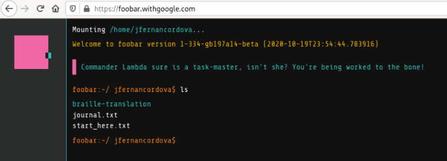

# Introducing myself
---

Hi! I'm José Fernando, a Backend Developer and an IT student originally from Venezuela and currently living in Argentina.
 
I'm passionate about PHP, Golang, Docker, and Linux. I would like to say that I was a geek all my life, but I wasn't.
 
I started to love programming, software stuff, and technologies thanks to my friends and teachers ever since I finished high school. I fought against myself because I did not understand how to think like a developer, but with practice, reading a lot, and listen to masters or craftsmanships around the world, I can finally say that it's possible.
 
This is why I always say to my friends, mates, or any person who wants to learn to program, it's possible.

## I have a few hobbies
---
- I like to play Tables Tennis, watch documentaries, series or movies and sometimes go out with my friends.

- I like to study, research, and read about software development all the time.

- I like reading about life, good habits, and meditation.

---

## I got a Google Foobar Invitation
---

While I was working and googling, the google search showed me something particular: **You're speaking our language. Up for a challenge?**. Thanks to this [article](https://medium.com/plutonic-services/ things-you-should-know-about-google-foobar-invitation-703a535bf30f) I realized that it was a real and extraordinary invitation!

This opportunity makes me think that all my learning is valuable. Unfortunately, I could not complete it because of work, assignments from college, and other responsibilities. I hope someday to try it. I'm on the right way!

---

## Recommended Reading Lists
[My Goodreads Reading List](https://www.goodreads.com/review/list/116582849-jos-fernando-cordova?print=true&ref=nav_mybooks&view=table)

---
### Software Development
- [The Pragmatic Programmer: From Journeyman to Master](https://www.amazon.com/Pragmatic-Programmer-Journeyman-Master/dp/020161622X)
- [The Clean Coder: A Code of Conduct for Professional Programmers](https://www.amazon.com/Clean-Coder-Conduct-Professional-Programmers/dp/0137081073)
- [Object-Oriented Analysis and Design with Applications](https://www.amazon.com/Object-Oriented-Analysis-Design-Applications-3rd/dp/020189551X)
- [Object Design Style Guide](https://www.manning.com/books/object-design-style-guide?a_aid=object-design&a_bid=4e089b42)
- [Refactoring: Improving the Design of Existing Code](https://www.amazon.com/gp/product/0134757599?ie=UTF8&tag=martinfowlerc-20&linkCode=as2&camp=1789&creative=9325&creativeASIN=0134757599)
- [Advanced Web Application Architecture](https://leanpub.com/web-application-architecture/)
- [Docker in Action](https://www.manning.com/books/docker-in-action)

### Life
-  [The Subtle Art of Not Giving a F*ck: A Counterintuitive Approach to Living a Good Life](https://www.amazon.com/Subtle-Art-Not-Giving-Counterintuitive/dp/0062457713)
-  [Everything Is F*cked: A Book about Hope](https://www.amazon.com/Untitled-Mark-Manson/dp/0062888439)
-  [How to Fail at Almost Everything and Still Win Big: Kind of the Story of My Life](https://www.amazon.com/How-Fail-Almost-Everything-Still-ebook/dp/B00COOFBA4)
-  [Atomic Habits: An Easy & Proven Way to Build Good Habits & Break Bad Ones](https://www.amazon.com/Atomic-Habits-Proven-Build-Break/dp/0735211299)
-  [How to Stop Worrying and Start Living](https://www.amazon.com/How-Stop-Worrying-Start-Living/dp/0671733354)
-  [The Four Agreements: A Practical Guide to Personal Freedom](https://www.amazon.com/Four-Agreements-Practical-Personal-Freedom/dp/1878424319)

---

## Recommended Course Lists
---
### Software Development
- [Docker Mastery: with Kubernetes +Swarm from a Docker Captain](https://www.udemy.com/course/docker-mastery)
- [Domain-Driven Design Fundamentals](https://www.pluralsight.com/courses/domain-driven-design-fundamentals)
- [Construcción de Software Robusto con TDD](https://academia.10pines.com/course_contents/4-construccion-de-software-robusto-con-tdd)

### Life
- [Learning How to Learn: Powerful mental tools to help you master tough subjects](https://www.coursera.org/learn/learning-how-to-learn)