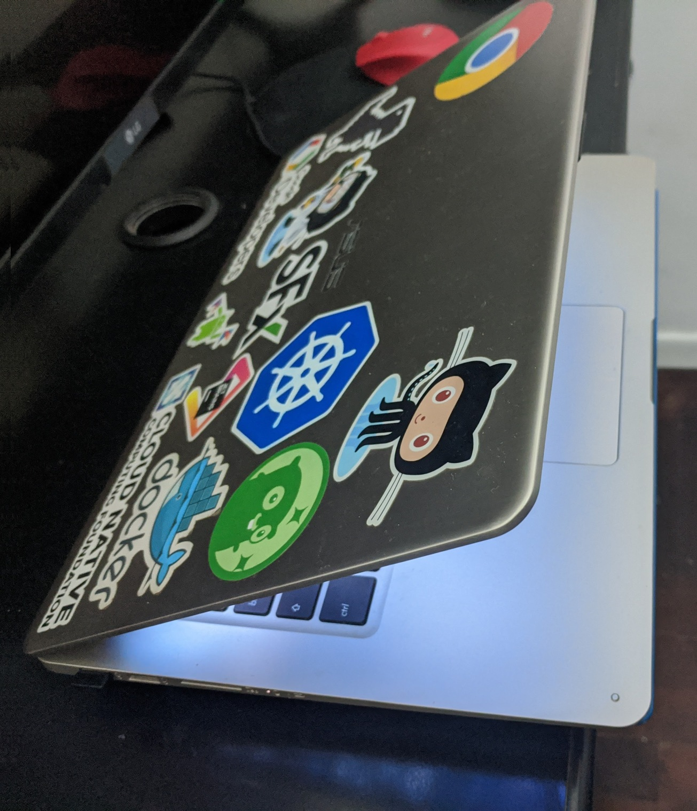
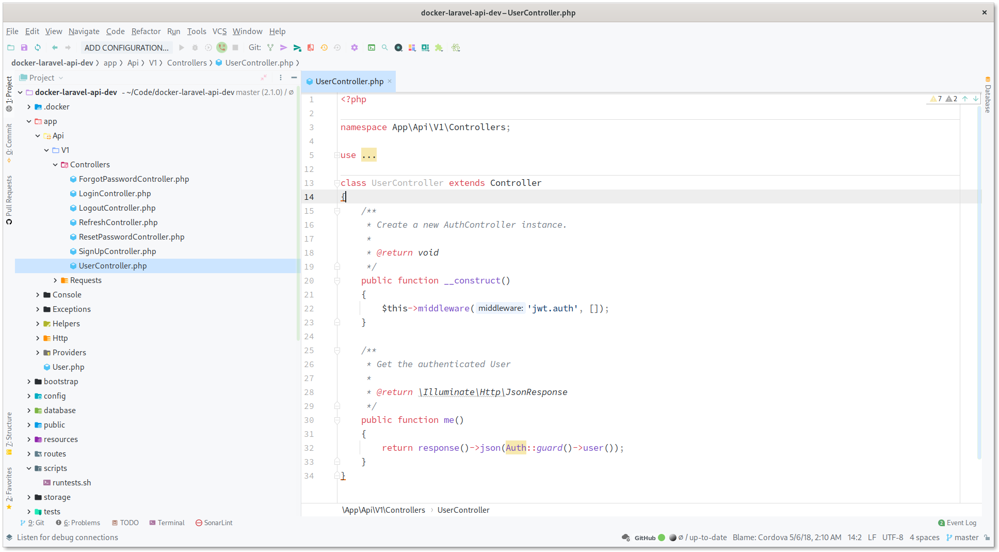
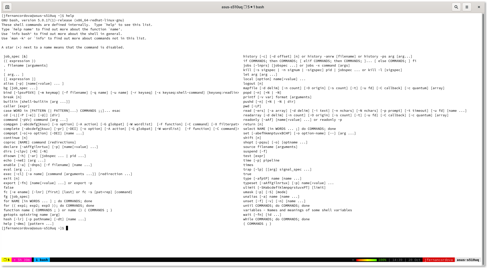

## Machine
---

[Notebook Asus Vivobook S15 I7 Nvidia Geforce 940mx, 4Ghz i7, 16GB RAM and 500GB SSD Storage](https://www.asus.com/Laptops/ASUS-VivoBook-S15-S510UQ).
I'm using [Fedora 32 Workstation](https://getfedora.org/) with Gnome as my default distro.

## Editor
---
I use PHPStorm as my primary editor and Visual Studio Code as my second one. My default theme is [GitHub Material](https://github.com/ChrisRM/material-theme-jetbrains) and [Source Code Pro](https://fonts.google.com/specimen/Source+Code+Pro) as global font. Thanks to this [video](https://www.youtube.com/watch?v=rDMI1dpNfdw&feature=youtu.be&t=353), I love using light mode for almost everything!

## Terminal
---

I use [Gnome Terminal](https://help.gnome.org/users/gnome-terminal/stable/) and [tmux](https://github.com/tmux/tmux/wiki) with [Oh My Tmux! Pretty & versatile tmux configuration](https://github.com/gpakosz/.tmux).

Sometimes when I need to modify specific files, VIM with [The Ultima vimrc](https://github.com/amix/vimrc) is my best choice.
I don't have many aliases, so I use [Github Gists](https://gist.github.com/jfernancordova/b98bb2259a02755bf26cd17a6a1c386b) to remember some shortcuts or commands.

## Productivity
---
* [GTD](https://gettingthingsdone.com/what-is-gtd/) is a great solution for me.
* I use [Notion](https://www.notion.so/) for my personal, work, and university activities.
* I mix Notion with GTD thanks to this [article](https://www.samuelthomasdavies.com/how-to-set-up-gtd-in-notion/).
* Sometimes I use [Anki](https://apps.ankiweb.net/) to study an exam or understand complex concepts.

## Environment
---
* I use [Docker](https://www.docker.com/) and [Docker Compose](https://docs.docker.com/compose/install/) for testing, coding, and deployments APIs or Apps.
* I use [Play With Docker](https://labs.play-with-docker.com/) with [Travis](https://travis-ci.com/) and [Continous Integration](https://docs.github.com/en/free-pro-team@latest/actions/guides/about-continuous-integration).

## Music
---
For headphones, I use the [Sony WH-1000XM3](https://www.sony.com/electronics/headband-headphones/wh-1000xm3) to code and traveling.

I use Spotify for music streaming, these are my playlists:
* [Code](https://open.spotify.com/playlist/64wXWgmR88vs34UtF9b5DB?si=MqAvoiQLRnSH5mPmsKGUnA)
* [BLOW Radio](https://open.spotify.com/playlist/37i9dQZF1E4qPb8puPcbpZ?si=9T5XyqJSRNmjHp97xaAQKA)
* [The Devil Remembers Me Radio](https://open.spotify.com/playlist/37i9dQZF1E8KhueUhX75me?si=L-QZDX2ISk675eKwy0IAkw)
* [Synthwave from Space](https://open.spotify.com/playlist/4sgUux9hmykyWYmVoe4W6p?si=kxzlcRntTz-oCF6w-I7FJA)
* [Retrowave/Synthwave](https://open.spotify.com/playlist/3ebHKSjHujS4Tyt2KKP97R?si=kwtLqUodQDOtXDEUglCq8A)

## Apps
---
Applications I use a lot:
* [KeePassXc Password Manager](https://keepassxc.org/)
* Google Calendar and Gmail
* [Ulauncher](https://ulauncher.io/)
* [Dropbox](https://www.dropbox.com/) and Google Drive 
* [Stacer](https://github.com/oguzhaninan/Stacer)
* [Mega](https://mega.nz/)
* [Mozilla Firefox](https://www.mozilla.org/en-US/firefox/new/)
* [Grammarly](https://www.grammarly.com)

