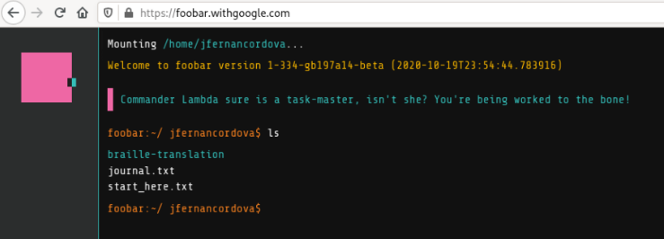

## The Google Foobar Invitation
---

While I was working and googling, I realized that google search showed me something particular: **You're speaking our language. Up for a challenge?**. I just thought that I was hacked or something like that, so I found this interesting [article](https://medium.com/plutonic-services/ things-you-should-know-about-google-foobar-invitation-703a535bf30f), and I was surprised!

This opportunity makes me think that all my learning is valuable. Unfortunately, I could not complete it because I have a lot of work, assignments from college, and responsibilities with my girlfriend. I hope someday to try it. I know I'm on the right way!

