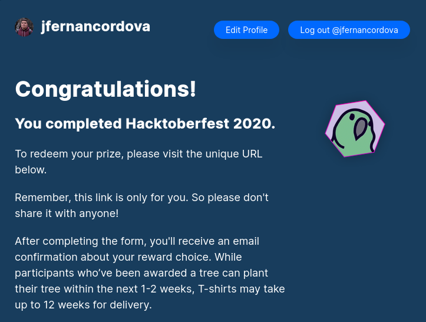

## Experience
---

I participated for the first time and, I could say, **it was amazing**.  I'm so happy to contribute to this great community and help to solve challenges. 

---

### Contributions
---
* [Carbon.sh CLI](https://github.com/CapitanFindusFI/carbonsh-cli/pull/3)
* [laminas-validator](https://github.com/laminas/laminas-validator/pull/75)
* [Silkroad Laravel](https://github.com/Devsome/silkroad-laravel/pull/73)
* [Laravel integration with Fatture in Cloud](https://github.com/offline-agency/laravel-fatture-in-cloud/pull/26)
* [Mage2Docker](https://github.com/graycoreio/mage2docker/pull/12)
* [Phpsu: Synchronisation Utility: File and Database](https://github.com/phpsu/phpsu/pull/167)
* [FonteSolutions](https://github.com/fontenele/php/pull/11)

---

## What I Learned
---
* I did not feel intimidated. Thanks to these challenges I could know, explore, and help other developers.
* Maintainers are friend. They suggested and advised my PRs.

---

## Notes
---

> Originally published at [dev.to](https://dev.to/jfernancordova/my-first-hacktoberfest-experience-37ik)