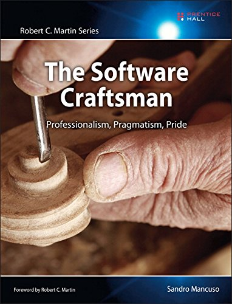

Cover of The Software Craftsman on <a href="https://www.amazon.es/Software-Craftsman-Professionalism-Pragmatism-Robert/dp/0134052501" target="_blank">Amazon</a>. 

## Introduction
---

When you want to grow up as a Software Engineer and start figuring out how to do it, you probably start looking for either a good course or a good book, and perhaps you find this book because the name piques your interest. So, I've finished this quite amazing book and I've learned a lot.

I'm going to quote the topics that I find most interesting to study and incorporate into our daily routine in order to be a great professional, enthusiastic, and passionate.

 

## Software craftsmanship
---

- It is about professionalism in software development, a mindset to be responsible for our own careers, constantly learning new tools and techniques.
- Being a craftman is more than being a good developer who writes code well and delivers business value.
- It is a lifestyle, not to be dogmatic about tools, languages, or frameworks.
- It means to be pragmatic, looking for simple solutions and using the best tools.
- It means to be curious and experiment with new thigs.
  
 

## Heroes, Goodwill, and Professionalism
---

- The best way to deal with them is to analyze everything that needs to be done and communicate all the possible risks we see and concerns we may have.
- Our job is to help our clients to figure out what their real needs are and also advise them on the best way to approach them.
   
 

## Technical Practices
---

- Software Craftsmaship encourages the adoption of XP practices like TDD, refactoring, simple design, continous integration and many others.
- As a software craftsmen, we should always keep an open mind and practices for the job and caring about and respect their customers.

 

## The Long Road
---

- We need to expand our tecnical knowledge, studying things that are out of our comfort zone, like new languages and technologies.
- Attend user groups and tecnical community events.
- Network with other developers and business people.
- Blog about the things we are learning and doing.
- Contribute to open source projects.
- Develop projects and make them publicly available.
- Attend conferences.

<em><strong>Note:</strong></em>
  > Expecting a return on investment from jobs should not be mistaken for the selfish and unprofessional attitude known as "CV Building" where developers do not care about their jobs and are there just to improve thir CVs, choosing tecnologies and methodologies for personal reasons and not beacuse they are fit for a specific purpose.

 

### Autonomy, Mastery, And Purpose
---

- <strong>Autonomy:</strong> It is when we are in control of what we do, how we do it, and when we do it.
- <strong>Mastery:</strong> It is when we are constantly learning and evolving: becoming better professionals and better human beings.
- <strong>Purpose:</strong> It is when we feel that our job is important and we are contributing to make things better, instead of just doing what we are told without understanding why.

> A successfull career doesn't come for free, carefully choosing our jobs and satifying all our client is the best way to construct a very successfull and pleasant career as a software craftsman.

 

## Recruitment
---

- Job descriptions are anti-patterns:
  - Absolute numbers
  - Keyword matching
  - Listing tecnologies
  - Wrong cultural fit criteria
  - Listing the wrong requirement
  - wrong filter
- A job it not just a job.

 

## The Cost of Low Morale
---

- Constrained by Lack of Motivation:
  - They don't feel they are empowered to do it.
  - They don't want to be the ones pushing it.
  - No one agrees on what the better thing is.
  - They don't care, it is just a job.
- Low morale can destroy a company.
- Embracing Agile processes an ideology is essential for providing the right environment.
- The best person to motivate a developer is another developer.

 

## Culture of Learning
---

It is one of the most efficient ways of injecting passion into a company.

- Book Club.
- Tech Lunch (Brown Bag Session).
- Group Discussions (Roundtables).
- Switch a Project for an iteration.
- Conduct Group Code Reviews.
- Hands-On Coding Sessions.
- Engage with External Technical Communities.

 

## Driving Technical Changes
---

It is about changing the culture of a team or trying to introduce new practices.

- Speack the same language.
- Be respectful.
- Learn how to listen.
- Lead by example.
- Being good at what we do, being able to communicate clearly.
- Understand:
  - Who you are speaking to.
  - The reasons for each person's thinking.
  - Your soft/hard skills.
- Identifying Skepticism Patterns (be careful with these types of developers):
  - <strong>The Uniformed:</strong> They don't know certain tools.
  - <strong>The Herd:</strong> They are not experienced enough to make certain desisions (lack of confidence).
  - <strong>The Cynic:</strong> They try to prove that they are smarter than everyone else.
  - <strong>The Burned:</strong> They don't want to try because they haven't had a good experience trying new tools or practice. 
  - <strong>The Time Crunched:</strong> They are always busy and never have time for anything.
  - <strong>The Indifferent:</strong> Simply does not care.
  - <strong>The Ivory-Tower Architect:</strong> They think they know it all, they are smarter than any developer.

 

## Pragmatic Craftmanship
---

- Great versus Mediocre:
  - Well-crafted code is simple, small, testable, easy to understand, and most important, does the job.
  - Code is the main source of bugs and pain, the less we write it, the better.
- Four Rules of Simple Design:
  - Pass all the tests.
  - Clear, expressive, and consistent.
  - Duplicates no behavior or configuration.
  - Minimal methods, classes, and modules.
- Proficient TDDers very rarely use design patters from the outset.
- Design Patterns are, and should always be, part of our toolkit.
         
 

## Building Our Careers. One Job at a time
---

- Working for a consultancy company can be a good way to get exposed to different types of projects and environments.
- Before choosing a job, we should ask the following questions:
  - What do I want for my career?
  - What is the next step to achieve that?
  - Is this job aligned with my career aspirations?
  - How much valuecan I add to this company?
  - What is the return on my investment?
  - How long (roughly) will the duration of my investment be?
  - In this job, will I have autonomy, mastery and purpose?

 

## Bibliography
---

- [The Software Craftsman: Professionalism, Pragmatism, Pride](https://www.amazon.es/Software-Craftsman-Professionalism-Pragmatism-Robert/dp/0134052501) by [Sandro Mancuso](https://twitter.com/sandromancuso).
