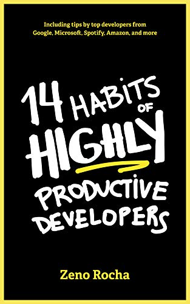

Cover of 14 Habits of Highly Productive Developers on <a href="https://www.amazon.com/14-Habits-Highly-Productive-Developers/dp/1735266531" target="_blank">Amazon</a>. 

## Introduction
---

I read this book because good habits help us become more productive, happy, passionate, and motivated. It is perfectly normal to feel unproductive for whatever cause, which is why we must fight ourselves over and over to reach our objectives.

As Software Engineers, it's always interesting to hear the perspectives of other developers who have developed good habits in many areas, that's why I'll quote the most fascinating topics from this book.

 

## Habit 1: Look For The Signal
---

- Avoid FOMO (the fear of missing out), adapt JOMO (the joy of missing out) instead, for any tool, programming language or frameworks.
- Desires are endless; needs are limited.
- Questions & Answers:
  - Focus on a few key things that drive our evaluations.
  - Accept that you cannot learn everything, you can learn enough to be effective though.
  
 

##  Habit 2: Focus On The Fundamentals
---

- It is important to understand core concepts such as algorithms, logic, network, accessibility, security and user experience.
- Try to get a basic understanding of the key concepts and search for examples of how others solve similar problems with it.
  
 

##  Habit 3: Teaching Equals Learning
---

- Find an event online and submit a presentation.
- Create an blog and share articles.
- One way of truly knowing a concept or techonology is trying to create a practical project.

 

##  Habit 4: Be Boring
---

- Infinitive Game vs Finite Game 
  - A finite game:
      - Programemers are focused on their bonus at the end of the year or waiting for that freelance project to end. 
  - A infinite game:
    - The rules are changeable.
    - New paradigm emerge.
    - New patterns emerge.
    - You cannot win in programming, you can only keep envolving the software to be better, more scalable, and more useful every day.
- Best programmers are reliable. You cannot have consistency without reliability.
- Best programmers don't give estimations based on perfect conditions.

 

##  Habit 5: Do It For Your Future Self
---

- Don't try to be clever, don't try to code something to make you feel smarter.
- You don't need to show off all the new tricks you just learned. Just write readable code.
- Thing about maintainability, meaningful names for every class, variable and methods.
- Have a good automated testing and use the version control as documentation.
- Early optimization is the root of all evil.
- No code should be added without unit tests, no bug fixed without a regression test. 

 

##  Habit 6: Your 9-to-5 Is Not Enough
---

- You can watch Netflix and still be productive.
- You can play any sport and still work on an open source project.
- You can enjoy quality time with your family and still read a book.

 

##  Habit 7: Master The Dark Side
---

> A person who knows how to code is powerful, a person who knows how to code and knows how business works is unstoppable.

- <strong>Save time:</strong> The better you understand the business, the more capable you will be to solve those problems yourself.
- <strong>Prevent complex code:</strong> when you have domain expertise, you are in a much better position to determine what part of the codebase needs more attention than others.
- <strong>Better prioritize: </strong> With better business knowledge it is easier to prioritize the micro-decisions you need to make when coding.
- Developers are essentially translators, our job is to translate user requirements into functionalities.
- Getting information from a key stakeholder can be very tricky since we all have a different understanding of the system.
- Light Side can be considered as programming, whereas Dark Side would be the business. The more we know about the business, the more valuable we are to the team.
- Start with the vocabulary, pay attention to the specific words and terms used by the business folks. You need to emulate the same terminology, because the communication will be much more effective.
- The best way to make sure I'm delivering something useful to the client is try to understand the business side.

> [The XY Problem](https://xyproblem.info/): When we ask how to implement our solution, when we should be talking about the problem itself.

 

##  Habit 8: Side Projects
---

- Side projects can be tremendous opportunity to grow your portfolio, build a résumé, and showcase your skills.
- They allow you to experience and learn new skills that your daily work might not offer.
- No pressure, schedules, or specifications imposed by anyone.
- The impact side projects give opportunities to create libraries and tools that can be used by others.

 

##  Habit 9: Mario or Sonic?
---

- <strong>Mario:</strong>
  - A programmer who stay at their job for six months and then move to another.
  - He is confident and strong, but most of the time, he's really just avoiding dangerous situations.
- <strong>Sony:</strong>
  - He is always willing to face the biggest challenges he can encounter.
  - A programmer who whould be always looking for complex problems to solve and for the most cutting edge tecnologies to work with.
  - He can learn new things, adapt to new challenges, and does not stay behind.
- Both are amazing and have potential to save the world, but if you have to choose between these two, don't be like Mario; Be like Sonic.
- You have to stay somewhere for a certain amount of time to make an impact and to expose yourself to the opportunities what will take your career to the next level.

 

##  Habit 10: Active Listening
---

- One misconception many people hjhave is that we need to listen to reply, whereas in reality, we need to listen to understand.
- Understanding someone is far more important than replying to someone.
- Practice the habit of active listening. Not just listening in order to reply.

> Anyone can reply, few can understand.

- Communication is an art and needs to be practiced every day, as well as an opportunity for letting us speak.
- We can use techniques like in order to be organized with the team:
  - [Zero Inbox](https://www.techtarget.com/whatis/definition/inbox-zero): is a rigorous approach to email management that aims to keep an inbox empty or almost empty at all. times.
  - [Bullet Journal](https://bulletjournal.com/): the system organizes scheduling, reminders, to-do lists, brainstorming, and other organizational tasks into a single notebook.

 

##  Habit 11: Don't Underestimate
---

- Why are we still so bad at sofware estimates?
  - We want to impress others.
  - We forget that's not all about coding.
  - We don't focus on one thing.
  - We thing everyone is the same.
  - We can't handle the pressure.
- We must admint that it is impossible to be 100% accurate with estimates.
- In the book [Software Estimation: Demystifying the Black Art by Steve McConnel](https://www.amazon.com/Software-Estimation-Demystifying-Developer-Practices/dp/0735605351):
  - Separating large tasks into smaller ones improves the accuracy of estimates.
  - <strong>Estimate in ranges</strong>:
    - Worst case.
    - Most likely case.
    - Best case.
  - For first time development with a new language/tool compare with development using a familiar language/tool, allows for a 20% to 40% increase in effort.
  - Document and communicate the assumptions embedded in your estimate.
  - "Bottom Up" based on estimates created by people who will actually do the work.
- Treat estimation discussions as problem-solving, not negotiation.
- Both you and the project stakeholders are on the same side of the table.
- A nice trick could be: Once you have that estimate, multiply it by 2. 

 

##  Habit 12: Specialist vs Generalist
---

- Once you become a senior, what path should you take next?
  - Become a specialist, someone aware of all the details in a certain subject.
    - <strong>Pros:</strong>
      - You can typically gain a lot of technical authority in a particular subject.
      - You need to keep up to date in only one platform/language.
    - <strong>Cons:</strong>
      - If the chosen technology has a risk of becoming obsolete, it will be hard to start from the bottom again.
      - If there is an urgent need to use another technology, there is a chance you will take longer to complete a certain task.
  - Become a generalist, someone able to tackle a variety of different subjects
    - <strong>Pros:</strong>
      - You are used to learning new tecnologies fast.
      - If you need job, you are flexible and easy to transition.
      - Switch Context: There is a change you will find a solution faster than others.
    - <strong>Cons:</strong>
      - It is possible that you will take a long time to solve very complex and technology-specific problems.
      - It is difficult to reach a leadership position if you are changing fields constantly.
- Create a habit of asking yourself: "How can I better help my team"

 

##  Habit 13: Control Your Variables
---

> <strong>Do you have a problem?</strong>
  - Yes
    - <strong>Can you do something about it?</strong>
      - Yes
        - <strong>Then don't worry.</strong>
      - No
        - <strong>Then don't worry.</strong>
  - No
    - <strong>Then don't worry.</strong>
  
- <strong>Variables that you can control:</strong>
  - Your thoughts.
  - What you eat and drink.
  - How you spend your money.
  - What you do with your time.
  - How you treat your body.
- <strong>Variables that you cannot control:</strong>
  - How people treat you.
  - What people think of you.
  - What people like or dislike.
- Stop wasting time on variables that are out of your control. Focus on the variables that you can change.

 

##  Habit 14: Stop Waiting
---

- There is always something to be accomplished or something to complain about.
- The only thing that prevents you from achieving something is yourself.
- The fact is, most people have the ability to recognize what bothers them, but only a few people have the courage and determination to face those challenges. 

 

## Bibliography
---

- [14 Habits of Highly Productive Developers](https://www.amazon.com/14-Habits-Highly-Productive-Developers/dp/1735266531) by [Zeno Rocha](https://14habits.com/).
- [The XY Problem](https://xyproblem.info/).
- [Zero Inbox](https://www.techtarget.com/whatis/definition/inbox-zero).
- [Bullet Journal](https://bulletjournal.com/).
- [Software Estimation: Demystifying the Black Art by Steve McConnel](https://www.amazon.com/Software-Estimation-Demystifying-Developer-Practices/dp/0735605351).
