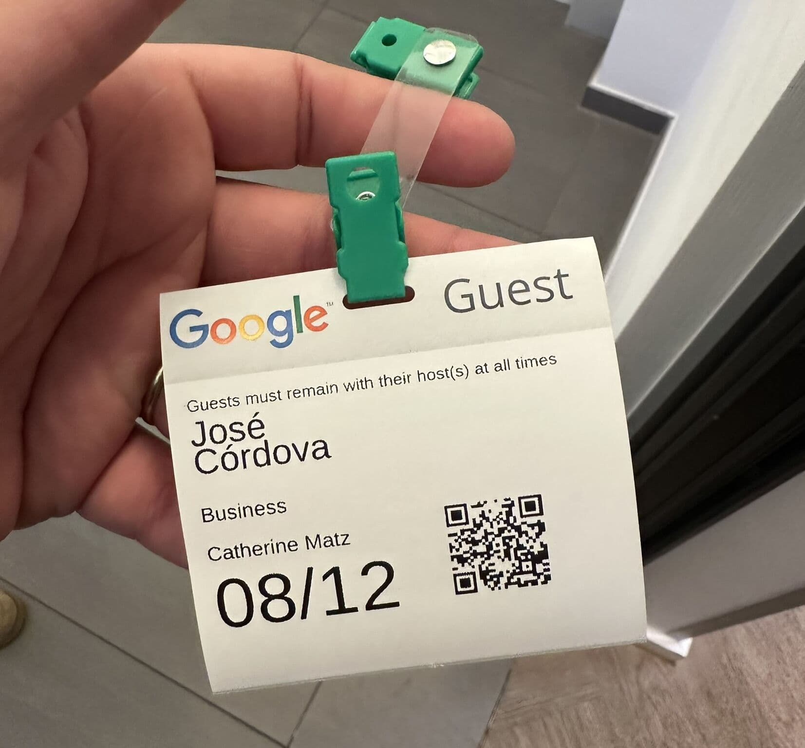
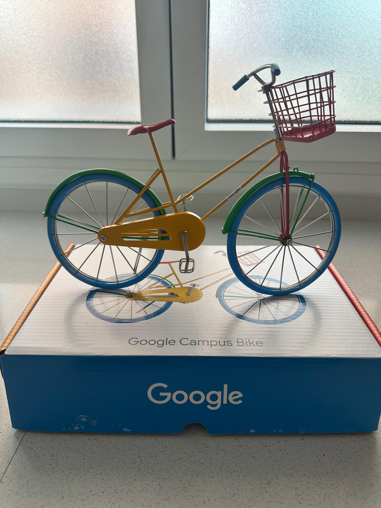

## Experience
---

I was invited to participate in the AI Hackathon organized by Google Cloud, where I had the opportunity to know, explore and use AI models built by Google.
At these times, I was not familiar with new concepts like [Large Language Models (LLMs)](https://en.wikipedia.org/wiki/Large_language_model "Large Language Models - AI models that can understand and generate human language") and [Generative AI](https://en.wikipedia.org/wiki/Generative_artificial_intelligence "Generative AI - AI systems that can generate new content"), [MCP (Model Context Protocol)](https://modelcontextprotocol.io/ "Model Context Protocol - Open standard for AI model integration") and ADK (Agent Development Kit).
Google Cloud provided a set of tools and resources to help me build and deploy AI agents using [BigQuery](https://cloud.google.com/bigquery "BigQuery - Google Cloud's data warehouse for analytics"), [Vertex AI](https://cloud.google.com/vertex-ai "Vertex AI - Google Cloud's machine learning platform"), and [Cloud Run](https://cloud.google.com/run "Cloud Run - Google Cloud's serverless container platform").

I was fascinated about how we can create AI agents that can help us to solve problems and improve our productivity, not only in the development process but also for any context.
I realized that we need somehow understand how to integrate these new techonologies with our current systems and processes, it is easy to deep dive into this but we need to be careful with the risks and limitations.

Google Cloud has invested a lot of resources to build and use different kind of techonlogies focused on AI, that means we can have different solutions for orchestrators, large databases, microservices, and APIs.

 

 

## From LLMs to Agents: A Recap of the Hackathon
---

We explored how to move beyond basic Large Language Models (LLMs) to build goal-oriented AI agents.
 
 

### The Evolution of AI
---

AI agents represent the next step in the evolution of AI. While traditional LLMs are great for generating text and [retrieval-augmented generation (RAG)](https://en.wikipedia.org/wiki/Retrieval-augmented_generation "Retrieval-Augmented Generation - AI technique that combines text generation with information retrieval") adds external data, agents go a step further. They are applications that perceive, decide, and act to achieve a specific goal. This is made possible by giving them access to tools like APIs and databases.
This shift from simple LLM prompts to multi-agent systems is key to unlocking new enterprise value.
 
 

### The Agent Development Kit (ADK)
---

A tool for building these systems. It's a client-side SDK that helps us create and customize multi-agent applications for complex, real-world scenarios. It provides a balance of deterministic and agentic methods, a rich tool ecosystem, and multi-agent by design capabilities. The ADK also allows for defining an agent and its tools with minimal boilerplate code.
 
 

### The Model Context Protocol (MCP)
---

Model Context Protocol (MCP), which acts as a "USB-C port" for AI models. This open standard bridges the gap between AI models and external data sources and tools, simplifying how LLMs get context and execute actions. MCP is used to connect agents to tools, APIs, and resources with structured inputs and outputs.
 
 

### Building Agents on Google Cloud
---

During the hackathon, I learned there are several ways to build agents on Google Cloud, each suited for different users and use cases.

- [Building Agents on Google Cloud](https://cloud.google.com/vertex-ai/docs/agents "Building Agents on Google Cloud - Google Cloud's platform for creating AI agents")
- [Agentspace](https://cloud.google.com/vertex-ai/docs/agentspace "Agentspace - Google Cloud's no-code UI for building AI agents"): A no-code UI for business users to build agents focused on internal employee productivity.
- [ADK + Vertex AI Agent Engine](https://cloud.google.com/vertex-ai/docs/agents "ADK + Vertex AI Agent Engine - Google's recommended path for building AI agents"): The recommended path for developers to build agents using Google's client-side ADK and deploy them on a fully-managed runtime.

We also explored how to connect agents to [BigQuery](https://cloud.google.com/bigquery "BigQuery - Google Cloud's data warehouse for analytics"), a powerful data warehouse for real-time structured data. This can be done using custom function tools with Python code or by using the [ADK](https://cloud.google.com/vertex-ai/docs/agents "Agent Development Kit - Google's SDK for building AI agents")'s built-in.
 
 

## Conclusion

This hackathon provided me a great overview of the powerful tools available on Google Cloud for building agents. The combination of ADK, MCP, and Vertex AI provides a robust framework for creating AI applications.

[A huge thank you to the Google Cloud Team for this incredible opportunity!](https://www.linkedin.com/feed/update/urn:li:activity:7361727319628988416)

